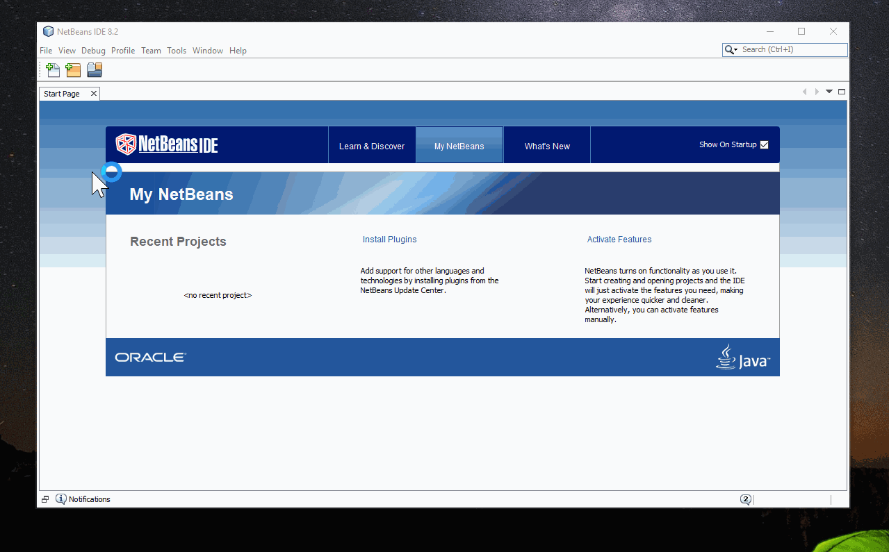

# NBAngularCLI
Create Angular-CLI projects within NetBeans

## Usage
- Make sure, that you have installed Angular-CLI `npm i -g @angular/cli`
- Set the cli at `Tools -> Options -> HTML/JS -> Angular CLI`
- Go to `File -> New Project -> HTML5/JavaScript -> Angular CLI Application`
- If you forget to set the cli inside the options, no worries, you will
  see a warning when you try to create a project.

## Screens
