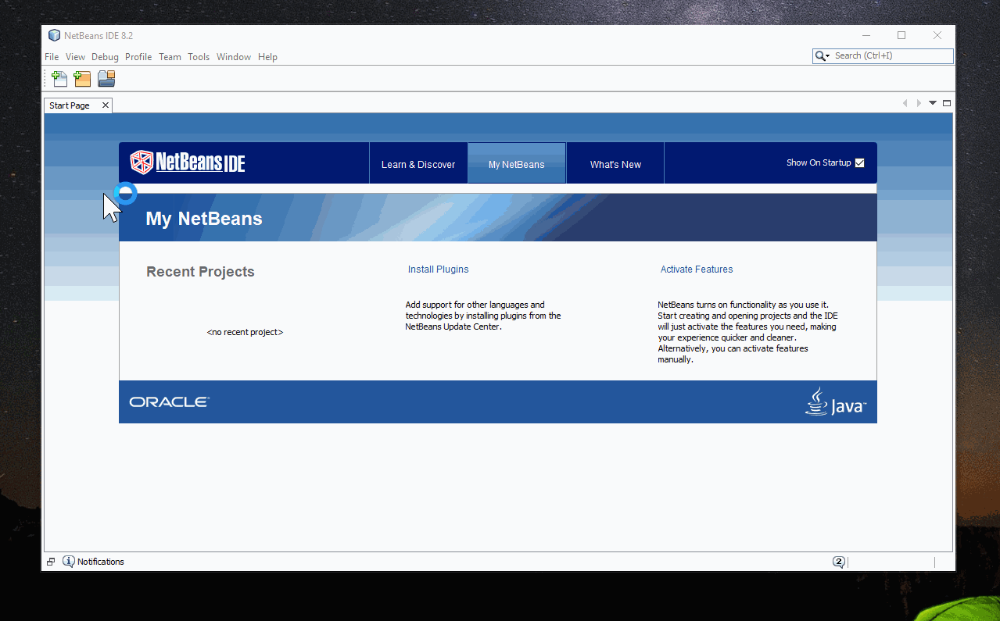

# NBAngularCLI
Create Angular-CLI projects within NetBeans

## Requirements
NBAngularCLI needs the HTML5 Kit module, which is part of NetBeans 8.2 in general, but not in NetBeans 9.0.
Please see this link to add old plugins from 8.2 into 9.0: https://blogs.apache.org/netbeans/entry/what-s-happened-to-my

## Usage
- Make sure, that you have installed Angular-CLI `npm i -g @angular/cli`
- Set the cli at `Tools -> Options -> HTML/JS -> Angular CLI`
- Go to `File -> New Project -> HTML5/JavaScript -> Angular CLI Application`
- If you forget to set the cli inside the options, no worries, you will
  see a warning when you try to create a project.

## Screens
